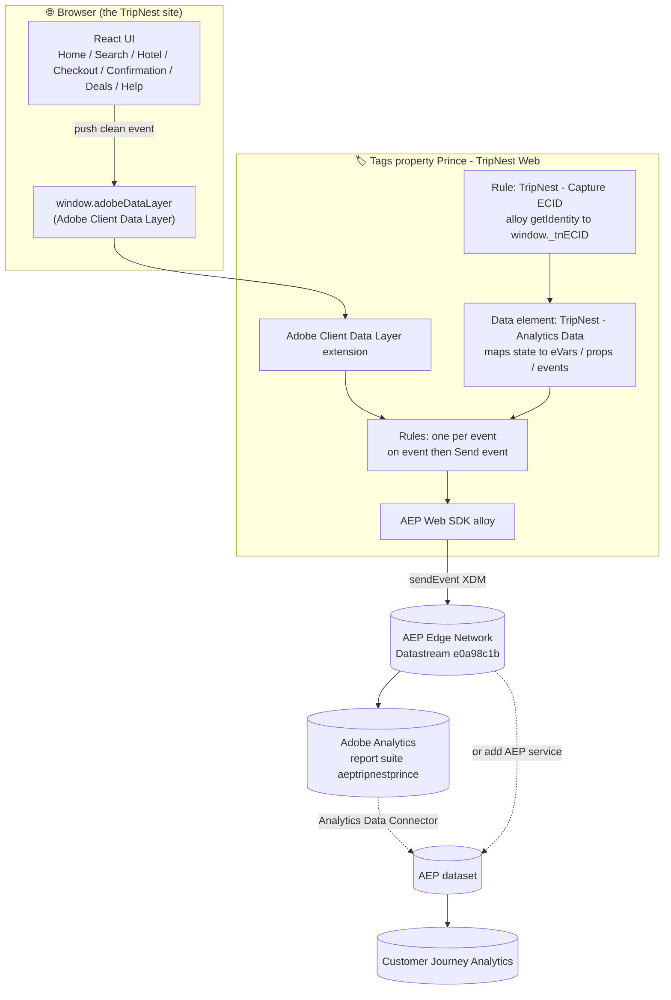
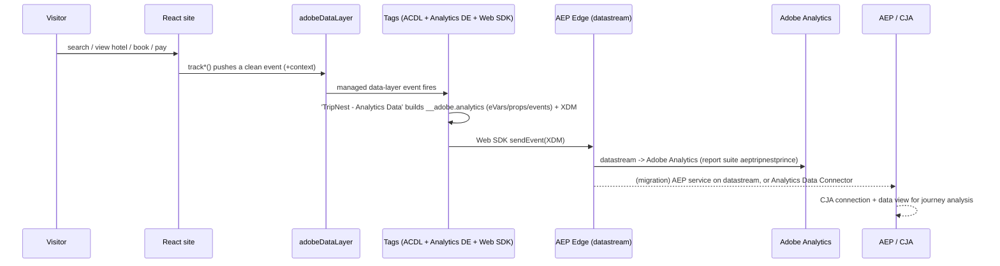

# TripNest 🏨 — Web SDK → Adobe Analytics → AEP → CJA: Complete Architecture & Handoff

> **What this project is:** a hotel-booking website built to tell one specific Adobe story — how a modern site can send **schema-driven XDM through the Web SDK + a Datastream into Adobe Analytics today**, and how that exact same collection can be **migrated forward** into **Adobe Experience Platform** (via the Analytics Data Connector) and analysed in **Customer Journey Analytics (CJA)** — with *no change to the website*. It is the "Analytics → CJA migration" companion to the Feastly demo (which sends straight to AEP).
>
> **How to read this doc:** Sections 1–4 explain the idea, the moving parts, and the IDs. Sections 5–9 are the build (site code, Tags property, the Analytics data element, rules, and the eVar/prop/event SDR). Section 10 is the end-to-end flow, Section 11 the migration story, and Sections 12–14 cover running/cloning, gotchas, and a glossary. All IDs reflect the **live** build in sandbox `princeparvat-prod` / report suite `aeptripnestprince`.

---

## 1. OBJECTIVE & THE MIGRATION STORY

TripNest is a fake travel brand. A visitor searches a destination, opens a hotel, starts a booking, checks out, and pays. Every action becomes a rich, **XDM-shaped** event.

The point of the project is the **path** that data takes:

1. **Today (Analytics):** the Web SDK sends XDM to the Edge; the Datastream forwards it to **Adobe Analytics** (a report suite), where it lands as eVars, props, and events — exactly what an existing Analytics customer sees.
2. **Migration (AEP):** the **Analytics Data Connector** can stream the same report-suite data into AEP as ExperienceEvents — or the Datastream can add the **AEP service** so the same XDM lands natively in a dataset.
3. **Tomorrow (CJA):** that AEP data is analysed in **Customer Journey Analytics**, where the custom booking/search fields become dimensions and stitching can join sessions into people.

**The punchline:** because the site emits clean XDM (not Analytics-specific `s.eVarN` calls), the *same* collection serves Analytics now and AEP/CJA later — the migration is a routing change in the Datastream, not a website rewrite.

---

## 2. ARCHITECTURE (big picture)



**One-line mental model:** *the site emits XDM once; the Datastream decides who receives it — Analytics today, AEP/CJA tomorrow.*

---

## 3. COMPONENTS IN PLAY

| Layer | Component | Role |
|---|---|---|
| Site | **React 18 + Vite + react-router-dom** | UI + a thin data-layer library (`src/analytics/*`) |
| Data layer | **Adobe Client Data Layer** | `window.adobeDataLayer`; the site pushes rich events here |
| Collection | **Tags property "Prince - TripNest Web"** | extensions + the Analytics data element + rules |
| Collection | **AEP Web SDK (alloy)** | sends XDM to the Edge; provides the ECID |
| Mapping | **Data element "TripNest - Analytics Data"** | turns data-layer state into `{__adobe:{analytics:{eVars/props/events}}}` |
| Identity | **Rule "TripNest - Capture ECID"** | reads the Edge ECID into `window._tnECID` → eVar23 |
| Transport | **Datastream** `e0a98c1b…` | routes XDM to Adobe Analytics (and optionally AEP) |
| Destination (today) | **Adobe Analytics** report suite `aeptripnestprince` | eVars / props / events |
| Destination (migration) | **AEP + CJA** | ExperienceEvents, profiles, journey analysis |

---

## 4. ENVIRONMENT, IDS & CONFIGURATION (source of truth)

| Item | Value |
|---|---|
| Org | **AEP Support** (`B504732B5D3B2A790A495ECF@AdobeOrg`) — entered in the Web SDK extension, not in code |
| Sandbox | **princeparvat-prod** — region VA7 |
| Tenant namespace | `_aepsupport` |
| Report suite | **Prince - TripNest** — ID `aeptripnestprince` |
| Datastream | **Prince - TripNest Web SDK** — ID `e0a98c1b-8e3a-4182-907f-17d529928ed5` |
| Tags property | **Prince - TripNest Web** |
| Tags embed (LIVE in `index.html`) | `https://assets.adobedtm.com/6a203c8a0ff8/c29a0e84645c/launch-4dc8cd6d2a9d-development.min.js` |
| Dev server | `http://localhost:5174` |

**Schema (for the AEP/CJA side):**

| Purpose | Name | Class |
|---|---|---|
| Event schema | `Prince - TripNest Booking Event` (aka *TripNest Booking ExperienceEvent*) | XDM ExperienceEvent |
| Custom field group | `Prince - TripNest Booking Details` (under `_aepsupport`) | — |
| Dataset (optional) | `Prince - TripNest Booking Event Dataset` | — |

> **Naming convention:** everything is prefixed `Prince - TripNest…`; data elements and rules are prefixed `TripNest -`. The IMS Org ID is intentionally **not** stored in the repo — it lives only in the Web SDK extension config in Tags.

---

## 5. REPOSITORY & CODE

```
hotel-booking-analytics-cja/
├─ index.html                 # inits window.adobeDataLayer + LIVE Tags embed (Prince - TripNest Web)
├─ vite.config.js             # dev server port 5174
├─ src/
│  ├─ main.jsx                # ReactDOM bootstrap (no StrictMode, no in-code Web SDK)
│  ├─ App.jsx                 # routes
│  ├─ analytics/
│  │  ├─ track.js             # THE DATA LAYER: every track*() builds + pushes one event
│  │  └─ session.js           # visitor/session/user + getGlobalContext() on every event
│  ├─ components/
│  │  ├─ Header.jsx           # nav + sign-in/out (trackLogout)
│  │  ├─ SignInModal.jsx      # trackLogin
│  │  ├─ SearchBar.jsx        # navigates to /search (no direct tracking)
│  │  ├─ HotelCard.jsx        # navigates to /hotel/:id (no direct tracking)
│  │  ├─ StarRating.jsx · Footer.jsx
│  ├─ data/hotels.js          # mock hotel inventory (ids HTL-001…) + destinations
│  └─ pages/                  # Home, SearchResults, HotelDetail, Checkout, Confirmation, Deals, Help
├─ tags/                      # reference copies of the Tags custom code (paste into the UI)
│  ├─ analytics-data-element.js   # "TripNest - Analytics Data" (eVars/props/events)
│  └─ capture-ecid-rule.js        # "TripNest - Capture ECID"
└─ README.md · SCHEMA.md · DATA-COLLECTION-SETUP.md · ADOBE-SETUP-GUIDE.md
```

### The data layer (`src/analytics/track.js`)
The only file that writes to `window.adobeDataLayer`.
- **Merged-state safety:** before each event it resets transient branches (`commerce`, `product`, `booking`, `search`, `authentication`, `hotel`) to `undefined` so ACDL's running merged state never bleeds values between events.
- **Serialized queue:** events spaced `EVENT_GAP_MS = 350` so co-firing events stay distinct.
- **ECID gating:** the first event waits until `window._tnECID` is set (by the Capture ECID rule) or a `2500 ms` timeout, so eVar23 is populated.
- **Envelope:** every push is `{ event, eventInfo:{timestamp, sessionDurationSec}, ...getGlobalContext(), ...payload }` and logs `[TripNest][dataLayer] <event>`.

Helper builders: `productItem(hotel, {nights,totalValue})` → `{id,name,category:'Hotels',quantity:nights,price}`; `bookingBlock(hotel, details)` → the full `_aepsupport.booking` object (bookingId, hotelId/Name/Rating, roomType, ratePlan, boardType, tripType, dates, nights, guests, rooms, totalValue, paymentMethod, loyaltyTier, cancellationPolicy).

### Session / identity (`src/analytics/session.js`)
First-party only (no Adobe cookies). Storage: `tn_visitor_id` (persistent), `tn_session_id` (per-tab) + `tn_session_start`, `tn_user` (logged-in user). `getGlobalContext()` merges `site`, `device`, `visitor`, `session`, `user`, and `marketing` (from UTM params) into every event. Email is captured at sign-in; `customerId = 'c-' + btoa(email)…` (demo pseudo-id, not real hashing). **ECID is not managed here** — it comes from the Web SDK/Edge and is captured into `window._tnECID` by the Tags rule.

---

## 6. TAGS (LAUNCH) IMPLEMENTATION — property "Prince - TripNest Web"

**Extensions:** Core, **AEP Web SDK** (alloy — configured with the datastream + IMS Org ID), **Adobe Client Data Layer**.

**The Analytics data element `TripNest - Analytics Data`** (`tags/analytics-data-element.js`) is the heart of the Analytics mapping. It reads ACDL `getState()` and returns `{ __adobe: { analytics: { eVarN, propN, events } } }`, which the Web SDK forwards to the Analytics report suite. It also contains `getECID()` (prefers `window._tnECID`, else parses the `kndctr_*_identity` cookie for the 38-digit ECID) → eVar23.

**The rule `TripNest - Capture ECID`** (`tags/capture-ecid-rule.js`): on Core → Library Loaded / DOM Ready, calls `window.alloy("getIdentity")` and stashes `identity.ECID` to `window._tnECID` (async — the very first pageView may not have it yet, which is why `track.js` gates on it).

**Per-event rules:** each rule's *Event* is an ACDL "Data Pushed" for a specific key; the *Action* is a Web SDK "Send event" with the XDM object (and the Analytics data element attached). See §7.

> **Two equivalent ways to fill Analytics variables** (the project documents both — pick one):
> 1. **`data.__adobe.analytics` from Tags** — the `TripNest - Analytics Data` element assigns eVars/props/events directly (what the code implements).
> 2. **Datastream mapping** — leave the site XDM clean and map `_aepsupport.*` → eVars/props in the Datastream's Analytics mapping UI. (Documented in `ADOBE-SETUP-GUIDE.md` §6.)

---

## 7. EVENTS → eventType MAP

| `track.js` function | data-layer `event` | XDM `eventType` | Key fields |
|---|---|---|---|
| `trackPageView(name)` | `pageView` | `web.webpagedetails.pageViews` | `page{name,url,path,referrer,title,siteSection}` |
| `trackSearch({...})` | `search` | `commerce.productListViews` | `search{destination,searchTerm,resultsCount,filterApplied,sortOrder}` |
| `trackHotelView(hotel)` | `hotelView` | `commerce.productViews` | `product`, `booking` |
| `trackBookingStart(hotel,d)` | `bookingStart` | `commerce.productListAdds` | `product`, `booking` |
| `trackCheckout(hotel,d)` | `checkout` | `commerce.checkouts` | `product`, `booking` |
| `trackPurchase(hotel,d)` | `purchase` | `commerce.order` (`commerce.purchases`) | `commerce.order{purchaseID,priceTotal,currencyCode,payments[]}`, `product`, `booking` |
| `trackLogin({email,tier})` | `login` | `web.webinteraction.linkClicks` (or custom) | `authentication{action:login}`, `user{authenticated,customerId,loyaltyTier}` |
| `trackLogout()` | `logout` | (no dedicated rule) | `authentication{action:logout}` |

Purchase order structure (exact):
```js
commerce.order = {
  purchaseID: details.bookingId,
  priceTotal: details.totalValue,
  currencyCode: 'USD',
  payments: [{ paymentType: details.paymentMethod, currencyCode: 'USD', paymentAmount: details.totalValue }],
}
```

---

## 8. ANALYTICS SDR (eVars / props / success events)

**Success events:** `event1` Hotel Search (Counter), `event2` Booking Started (Counter), `event3` Checkout Started (Counter), `event4` Login (Counter), `event5` Booking Revenue (Currency). Product views / cart adds / checkouts / purchases use the built-in commerce events.

**eVars (Most Recent / expire on Visit):**

| eVar | Value | eVar | Value |
|---|---|---|---|
| eVar1 | search.destination | eVar13 | booking.bookingId |
| eVar2 | search.searchTerm | eVar14 | booking.paymentMethod |
| eVar3 | booking.hotelName | eVar15 | booking.loyaltyTier |
| eVar4 | booking.hotelId | eVar16 | search.filterApplied |
| eVar5 | booking.starRating | eVar17 | search.sortOrder |
| eVar6 | booking.roomType | eVar18 | page.name |
| eVar7 | booking.ratePlan | eVar19 | visitor.type |
| eVar8 | booking.boardType | eVar20 | device.type |
| eVar9 | booking.tripType | eVar21 | marketing.campaign |
| eVar10 | booking.nights | eVar22 | booking.cancellationPolicy |
| eVar11 | booking.guests | **eVar23** | **ECID** |
| eVar12 | booking.rooms | | |

**props:** prop1 page.name · prop2 page.siteSection · prop3 search.destination · prop4 booking.hotelName · prop5 device.type · prop6 tripType · prop7 loyaltyTier · prop8 visitor.type · prop9 search.filterApplied · prop10 search.sortOrder.

> ⚠️ **Known doc inconsistency to reconcile before go-live:** the code (`tags/analytics-data-element.js`) uses eVar18=page.name, eVar19=visitor.type, eVar20=device.type, whereas the Datastream-mapping table in `ADOBE-SETUP-GUIDE.md` §6 shows eVar19=user.customerId. Pick **one** mapping approach (§6) and make the eVar assignments consistent. Also: `SCHEMA.md`'s `booking` object omits some fields the code sends (starRating, ratePlan, boardType, rooms, cancellationPolicy) — align the schema field group with `track.js` before ingesting to AEP.

---

## 9. XDM SCHEMA (for the AEP / CJA side)

**Schema `Prince - TripNest Booking Event`** (class = XDM ExperienceEvent).
- **Standard field groups:** Web Details (`web`), Environment Details (`environment`), Commerce Details (`commerce` + `productListItems[]`) — these auto-map to Analytics variables.
- **Custom field group `Prince - TripNest Booking Details`** (under `_aepsupport`):
  - `booking` — bookingId, hotelId, hotelName, hotelRating (double), starRating, roomType, ratePlan, boardType, tripType, checkInDate (date), checkOutDate (date), nights (int), guests (int), rooms (int), totalValue (double), paymentMethod, loyaltyTier, cancellationPolicy
  - `search` — destination, searchTerm, resultsCount (int), filterApplied, sortOrder

In CJA, the standard fields become out-of-the-box dimensions/metrics and the custom `booking.*` / `search.*` fields become **custom dimensions** — e.g. bookings and revenue broken down by tripType, roomType, loyaltyTier, or destination.

---

## 10. DATA FLOW (sequence)



---

## 11. THE MIGRATION PATH (Analytics → AEP → CJA)

This is the reason TripNest exists. Three states, one unchanged website:

1. **State A — Analytics only (today).** Datastream has the **Adobe Analytics** service pointed at report suite `aeptripnestprince`. eVars/props/events populate as in §8.
2. **State B — Add AEP.** Two options, no site change:
   - **Analytics Data Connector** — streams the report-suite data into an AEP dataset (classic lift-and-shift for existing Analytics customers), **or**
   - **Add the AEP service** to the same Datastream so the identical XDM lands natively in `Prince - TripNest Booking Event Dataset`.
3. **State C — CJA.** Build a CJA connection on the AEP dataset + a data view; the `booking.*`/`search.*` fields become dimensions, and stitching can join anonymous sessions to known bookers (mirrors the ecommerce lab's field-based stitching approach).

**Why it's a routing change, not a rewrite:** the site never calls Analytics APIs directly. It emits XDM to a data layer; Tags forwards XDM. Whichever services the Datastream fans out to is a configuration choice — so the same collection serves Analytics, AEP, and CJA.

---

## 12. RUN / CLONE / DEPLOY

```bash
npm install
npm run dev     # http://localhost:5174
npm run build   # production build
```

- The Tags embed is **already live** in `index.html` (Prince - TripNest Web, Development). To point at your own property, replace that embed `<script>` and set your datastream + IMS Org ID inside the Web SDK extension in your Tags property.
- The site runs **data-layer-only** if you remove the embed (useful to inspect `window.adobeDataLayer` in the console before wiring Adobe).
- The `tags/*.js` files are **reference copies** of the custom code to paste into the Tags UI (data element + rule) — they are not imported by the site.

---

## 13. GOTCHAS & DECISIONS

- **First pageView may lack the ECID** — `getIdentity` is async. `track.js` gates the first event on `window._tnECID` (2.5 s timeout) so eVar23 is reliably set.
- **ACDL merged-state bleed** — transient branches are reset before each event; without this, e.g. a `search` value would linger onto a later `purchase`.
- **Two mapping approaches** (Tags `__adobe.analytics` vs Datastream mapping) — don't do both for the same variable; reconcile the eVar18/19/20 discrepancy noted in §8.
- **Schema drift** — align `Prince - TripNest Booking Details` with the fields `track.js` actually sends (starRating, ratePlan, boardType, rooms, cancellationPolicy) before AEP ingestion.
- **No bulk variable-enablement API** — Analytics 1.4 Admin API is EOL and 2.0 doesn't manage eVar/prop enablement; enable them in Report Suite Manager (or drive it via Datastream mapping).
- **Booking requires sign-in** — `HotelDetail`/`Checkout` gate on `getUser()`; an anonymous booker is prompted to sign in first (order tied to a known identity).

---

## 14. GLOSSARY

- **ACDL** — Adobe Client Data Layer; `window.adobeDataLayer`. Site pushes; Tags forwards.
- **eVar / prop / event** — Adobe Analytics conversion variable / traffic variable / success metric.
- **Datastream** — server-side Edge config that routes XDM to Analytics and/or AEP.
- **Analytics Data Connector** — the service that brings Adobe Analytics data into AEP as ExperienceEvents.
- **CJA** — Customer Journey Analytics; analyses AEP datasets with cross-channel stitching.
- **ECID** — Experience Cloud ID (device identity) set by the Web SDK; here captured to `window._tnECID` → eVar23.
- **Report suite** — the Analytics container that receives the events (`aeptripnestprince`).

---

*End of TripNest architecture handoff. Companion setup docs: `DATA-COLLECTION-SETUP.md` (Tags steps) and `ADOBE-SETUP-GUIDE.md` (full eVar/prop/event + datastream mapping).*
